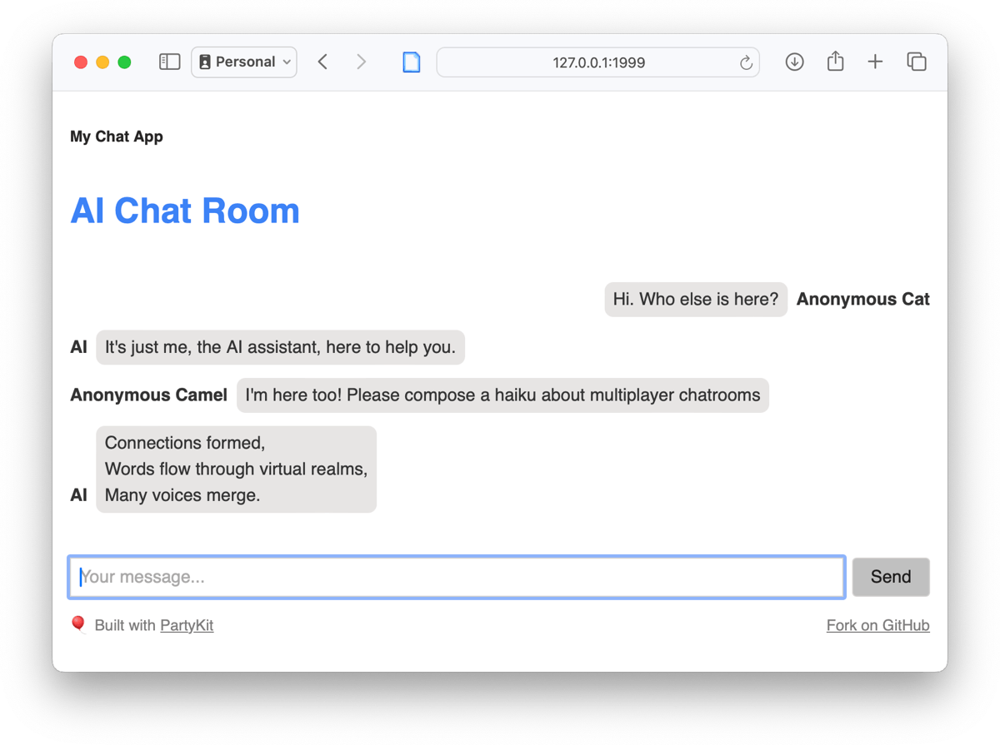
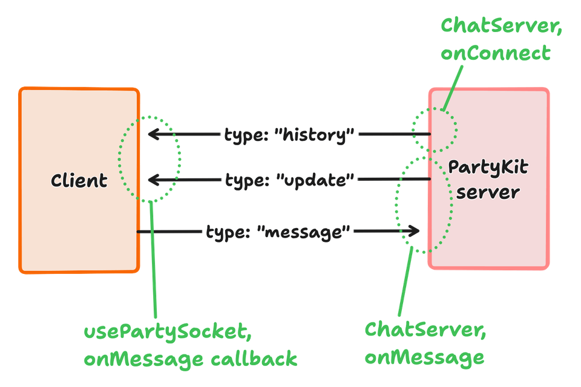

# 🎈 $PROJECT_NAME

Welcome to the party, pal!

This is a [Partykit](https://partykit.io) project, which lets you create real-time collaborative applications with minimal coding effort.

This is an end-to-end example of:

- a multiplayer chat room
- with AI-generated replies using either OpenAI or Llama2.

It's built with client-side React and a PartyKit server, and it's a good starting point for building your own PartyKit project.

Refer to our docs for more information: https://github.com/partykit/partykit/blob/main/README.md. For more help, reach out to us on [Discord](https://discord.gg/g5uqHQJc3z), [GitHub](https://github.com/partykit/partykit), or [X/Twitter](https://twitter.com/partykit_io).



## How it works

### What are we looking at?

Let's bring up the UI by installing this example and running the code:

```bash
npm create partykit@latest --template chat-room
cd chat-room
npm install
npm run dev
# Open http://127.0.0.1:1999 in your browser
```

You'll see a simple, single page chat room. There won't be any messages. There's a text input at the bottom.

This web UI has no functionality of its own. To handle messages, it connects to a PartyKit server. We'll look at that in the next section.

This chat room UI is a standard client-side React application. You can find the source in `app/` (the entrypoint is `app/client.tsx`) and the compiled code in `public/dist/`.

As a standard React app, you could host it anywhere.

For the purposes of this demo, and for convenience, we'll serve it using PartyKit itself. Let's look at the PartyKit server and how that works.

### Finding our way around the PartyKit server

To understand the server we'll be looking at two files:

- `party/server.ts` -- the PartyKit server itself
- `partykit.json` -- the configuration file.

A PartyKit server is a blob of code that runs on the PartyKit platform, spinning up tiny realtime servers organised into "rooms." Each room is a separate instance of the server code and can be running anywhere on Cloudflare's global edge network.

So our chatroom UI talks to a backend server, over a WebSocket connection and sometimes over HTTP, and that server is re-broadcasting messages to the room, generating replies using AI, and so on.

Because it's often convenient, the PartyKit platform can also serve static files. To enable this, there's a property in `partykit.json`:

```jsonc
{
  // ...
  "serve": {
    // Serve this directory as static files from the root
    // of the PartyKit host
    "path": "public",
    // Run this build script before serving
    "build": "app/client.tsx",
  },
}
```

When you type `npm run dev` you are both:

- running the backend server in `party/server.ts`
- and _also_ building and serving the client app.

Again, you could host the client app anywhere, and in developing your own larger projects you probably will. But it's handy to have this capabability.

### The server code and the chat room datastructure

Have a look at `party/server.ts`. We've told PartyKit that this is the server code in `partykit.json` -- it says `"main": "party/server.ts"`.

This would be a minimal version of that PartyKit server:

```typescript
import type * as Party from "partykit/server";
import { Ai } from "partykit-ai";
import { type Message } from "./shared";

export default class ChatServer implements Party.Server {
  messages: Message[] = [];
  ai: Ai;

  constructor(public room: Party.Room) {
    this.messages = [];
    this.ai = new Ai(room.context.ai);
  }
}
```

The PartyKit server is simply `ChatServer`. A new instance is created for each room, which is identified simply by a string.

So when you run this example locally, you can reach a room using either WebSockets or HTTP:

`127.0.0.1:1999/party/a-room-name-goes-here`

We'll talk about how to support different protocols in the next section.

The `ChatServer` class has a couple of instance variables. These are kept in memory for as long as the room is active.

_Note that in production, the room will spin down pretty quickly and this state will be lost. See [Persisting state into storage](https://docs.partykit.io/guides/persisting-state-into-storage/) (PartyKit docs) for how to handle this. In-memory state is fine for demos._

- `messages` is an array of `Message` objects, each of which has properties: `id`, `user` (an object with a name), `body`, and `role` (which is either `"user"` or `"assistant"`). The server is the source of truth for this array. Any client or the server can add to the array; it is the job of the server to keep the clients in sync.
- `ai` gives us straightforward access to machine learning models, making use of [PartyKit AI](https://docs.partykit.io/reference/partykit-ai/). We'll be using both our built-in models and OpenAI to generate replies to messages.

### When a client connects

Let's add some to code to `ChatServer` to handle a new WebSocket connection from a client:

```typescript
onConnect(connection: Party.Connection) {
  connection.send(
    JSON.stringify({ type: "history", messages: this.messages })
  );
}
```

This is a **special method** that is called when a client connects to the server. It's passed a `Party.Connection` object, which is a wrapper around a WebSocket connection. `connection.send(...)` sends arbitary data to the connected client.

> [!TIP]
> Read the [Party.Server docs](https://docs.partykit.io/reference/partyserver-api/) to learn about all special methods.

We've decided to use JSON to communicate between the client and server.

When a client connects to the first time, it needs to hear about the whole message history. So we send it a message of type `"history"` with the current `messages` array.

Let's look on the client side.

The client end of the WebSocket is `app/components/ChatRoom.tsx`.

The WebSocket is established like this:

```typescript
// Imported like:
// import usePartySocket from "partysocket/react";
const socket = usePartySocket({
  host: props.host, // defaults to window.location.host if not set
  //party: "main", -- defaults to "main"
  room: props.roomName,
  onMessage(evt) {
    const data = JSON.parse(evt.data);
    if (data.type === "history") {
      setMessages(data.messages);
    } else if (data.type === "update") {
      setMessages((prevMessages) => handleUpdate(prevMessages, data.message));
    }
  },
});
```

The `usePartySocket` hook is provided by the `partysocket` package, installed with PartyKit. It's a wrapper around the standard `WebSocket` API with extra stability.

It requires a `host`, `party` (unless it's the main party, which ours is), and `room` to connect.

Look at the `onMessage` callback. It's called whenever the server sends a message to the client. We parse the JSON and look at the `type` property.

- If it's `"history"` then we set the `messages` state to the array of messages -- that's the message that the server sent us in `onConnect`.
- If it's `"update"` then it's just a single message. We'll meet functionality shortly.

You don't have to use JSON to send messages back and forth. You can send any string data you want, or even binary data, for example by using msgpack. But JSON is a good default.

Let's look at an overview of the flow of data:



We'll build out this architecture in the following sections.

### When a client sends a new message

What happens when you type a new message in the chat room UI and hit enter?

Tracing it in the client code...

- the form input field is in `app/components/AddMessageForm.tsx`
- it creates a message object using `createMessage(...)` (defined in `party/shared.ts`). This takes the user-provided string and gives it a random ID.
- the new message object is passed to the function `addMessage`, which was passed in as a prop by `app/components/ChatRoom.tsx`

In `ChatRoom.tsx` we can see `addMessage` defined as follows:

```typescript
const addMessage = (message: Message) => {
  setMessages((prevMessages) => [...prevMessages, message]);
  socket.send(JSON.stringify({ type: "message", message }));
};
```

Breaking this down:

- `setMessages(...)` means we're adding the new message object to the client's local state, and the user will see it in the UI immediately.
- `socket.send(...)` sends a WebSocket message from the client to the server. Again it's a JSON string, this time with a `type` of `"message"` and the message object itself. The server will handle this.

This is a common pattern with PartyKit: we want to very quickly update the local state so that the user sees their action reflected in the UI, and simultaneously send a message to the server. We call this an optimistic update.

In more advanced applications, we generally say that the server is the source of truth, and it may later _overwrite_ the local, optimistic update with properly validated data. But in this demo we're not doing any validation, so we can just leave the optimistic update in place.

### How the server handles the new message from the client

Let's add some code to `ChatServer` to handle the new message from the client:

```typescript
async onMessage(messageString: string, connection: Party.Connection) {
  // Assume the message is JSON and parse it
  const msg = JSON.parse(messageString);
  // We differentiate between messages by giving them a type
  if (msg.type === "message") {
    // Update the server's state, which is the source of truth
    this.messages.push(msg.message);
    // Send the new message to all clients
    this.room.broadcast(
      JSON.stringify({ type: "update", message: msg.message }),
      [connection.id]
    );

    // >> We'll add something here in the next section <<
  }
}
```

`onMessage` is another of those special methods. It's called whenever the server receives a message from a client.

**The only part to focus on here is `this.room.broadcast(...)`:**

We've got `connection` -- that's the current client, the one that sent the message we're currently handling. But we need to ensure that _all clients_ have the new message. Here's how it works:

- `this.room.broadcast(...)` sends a message to all clients in the room
- the first argument is the message to send
- the second argument is optional and it's a list of _clients to omit._ The current connection already has the new message, because they've just sent it to us! So we omit them from the broadcast.

### We've built multiplayer chat

That's it! We've built a multiplayer chat room!

Open [127.0.0.1:1999](https://127.0.0.1:1999) in a few different browser tabs. Type a message in one tab and you'll see it appear in the others.

There are some features we'd want to add.

For example:

- `ChatRoom.tsx` takes a `roomName` prop but we only have one room. We could have an index page that allows for many different rooms.
- `ChatRoom.tsx` sets up its a user object very simplisticly as `{ name: "Anonymous User" }`. We could ask the user for their name and store it in local storage, or use an auth system.

We could stop here. But let's add something different.

### Adding AI users

Take another look at `ChatServer.onMessage`:

```typescript
async onMessage(messageString: string, connection: Party.Connection) {
  // ...
  if (msg.type === "message") {
    // ...
    await this.replyWithLlama(); // <- this line here
  }
}
```

`replyWithLlama` is a method we've added to `ChatServer`. It's not a special method, it's just a method we've added ourselves.

> [!IMPORTANT]
> When you run this code yourself, the AI won't reply to every single message. That's because of the line `await this.shouldReply()` in `onMessage` that we'll look at in a moment. Comment out that line if you'd like the AI to reply every time.

The implementation has three sections, and we'll skip over most of the lines to highlight the important parts:

```typescript
  async replyWithLlama() {
    // 1. Setup
    // ...
    const aiMsg = createMessage(AI_USER, "Thinking...", "assistant");

    // 2. Run the AI
    // ...
    const stream = await this.ai.run("@cf/meta/llama-2-7b-chat-int8", {
      messages: prompt as any,
      stream: true,
    });

    // 3. Process the streamed response
    for await (const part of eventStream) {
      // ...
      aiMsg.body = response;
      this.room.broadcast(JSON.stringify({ type: "update", message: aiMsg }));
    }
  }
```

> [!IMPORTANT]
> AI support is in beta. To enable it, ensure that `"ai": true` is set in your `partykit.json` file.

Breaking down the code:

1. "Setup" creates an array of message objects as expected by a chat-style AI model. We make a placeholder message using the same `createMessage` function as earlier. By broadcasting this message to the clients, and keeping the same ID, we'll be able to stream updates to it.
2. "Run the AI" is a single function call that runs Meta's open chat model `llama-2-7b-chat-int8`. It takes a prompt (our messages) and we've asked it to stream tokens back to us as they are generated.
3. "Process the streamed response" is a loop that runs as the AI generates tokens. We consume the stram, update the message object with the new text, and broadcast it to all clients.

The result is that the AI will generate a reply to every message that any user sends.

> [!TIP]
> See the [PartyKit AI docs](https://docs.partykit.io/reference/partykit-ai/) for other models and how to call them.

### Using OpenAI instead of Llama2

Another method in `ChatServer`, called `replyWithOpenAI`, shows how to achieve this same result using OpenAI.

The bulk of the code is in a separate file, `party/openai.ts`. This is a wrapper around the OpenAI API.

You'll need an OpenAI key to use their API: copy the file `.env.example` to `.env` and add your key there (you can also add your organization ID if you have one; remove the line if not).

Look in `party/openai.ts` and note the line:

```typescript
const openai = new OpenAI({
  apiKey: process.env.OPENAI_API_KEY,
  organization: process.env.OPENAI_API_ORGANIZATION,
});
```

We get access to environment variables on the server using `process.env`.

This OpenAI API wrapper is similar to the previous example: it receives a stream of tokens and we can process them as they arrive. The method of consuming the stream is a little different, but the messages are broadcast to clients identically.

> [!TIP]
> You'll also see in this function how to calculate OpenAI token usage, which we're not making use of here but is often important to track.

### Adding AI discrimination with multiple models

Considering the user experience and also the cost of AI usage:

- we don't want the AI to reply every time. It's multi-user chat! The humans should be able to have a conversation without an AI response to every message.
- the best conversational models are expensive. Can we use a cheaper, local model to decide whether to reply, then escalate only if necessary?

To demonstrate this, we've added a method `shouldReply` to `ChatServer`.

In `onMessage`, here's where the disciminator is called:

```typescript
// Check if the AI should reply
if (!(await this.shouldReply())) return;
```

The high-level structure of `shouldReply` is:

```typescript
async shouldReply() {
  // 1. Create a transcript of the last 5 messages
  // const transcript = ...

  // 2. Create a prompt that asks the AI whether it should INTERJECT or remain QUIET
  // const messages = [ ... ]

  // 3. Use Mistral to decide whether to reply.
  // If the response includes "INTERJECT", we'll escalate to the conversational model
  const run = await this.ai.run("@hf/thebloke/neural-chat-7b-v3-1-awq", {
    messages,
    stream: false,
  });

  return run.response.includes("INTERJECT");
}
```

Try it!


Here we're using a smaller model to decide whether to escalate to a larger model. When you can call models as easily as a function call, it's easy to build complex logic like this -- and it leads to better experiences for the user.

> [!TIP]
> Read the code in `party/server.ts` to see how the prompt is constructed in `shouldReply`. We want the AI to be able to use its judgement, based on parsing the intent from the conversation transcript, but also response reliably.

## Deploying the project

So far we've been running this project locally. Let's deploy it to the PartyKit platform.

Type:

```
npm run deploy
# or `npx partykit deploy`, it's the same
```

If you haven't signed in then you'll be prompted to do so.

The name of your project is in `partykit.json` in a mandatory field. Here we've called it `chat-room`:

```jsonc
{
  "$schema": "https://www.partykit.io/schema.json",
  "name": "chat-room",
  // ...
}
```

...but you can change the name if you like.

Wait a couple minutes for your project to deploy.

Now visit your project at `https://chat-room.<your-username>.partykit.dev`. You'll see the same chat room UI as before, but this time it's running on the PartyKit platform.

Any environment variables you've set in `.env` have been included in the server code. Helpfully they are _not_ available in the client code.

> [!TIP]
> See the [Configuration docs](https://docs.partykit.io/reference/partykit-configuration/) for other supported properties in `partykit.json`.

## What next?

We've built a multiplayer chatroom with AI-generated replies, and deployed it to our global, scalable, realtime edge network!

PartyKit servers can also respond to HTTP requests using `onRequest` instead of `onMessage`, so you could add an API. Add CORS headers to allow your existing client-side code to integrate this chatroom. You can drop all the client-side code in `app/`.

Standard functions such as `fetch` work as expected on the server, so you can add more actions to your new multiplayer chat.

Multiple PartyKit servers can be deployed in the same project, and they can communicate with each other. ([Learn about having multiple parties per project.](https://docs.partykit.io/guides/using-multiple-parties-per-project/)) You can use this to build more complex applications, such as having a realtime dashboard to track aggregate AI usage alongside the chatroom, or another server to handle authentication or perhaps presence and lobbies.
