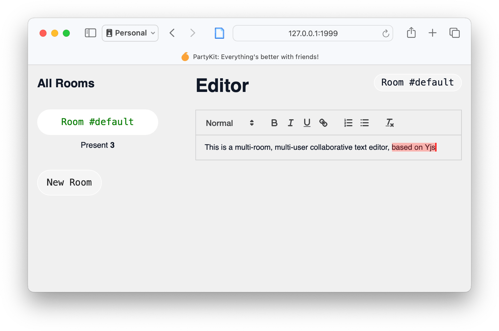

# 🎈 Template: yjs-text-editor

Welcome to the party, pal!

This is a [Partykit](https://partykit.io) project, which lets you create real-time collaborative applications with minimal coding effort.

This is an end-to-end example of:

- a multiplayer chat room
- with AI-generated replies using either OpenAI or Llama2.

It's built with client-side React and a PartyKit server, and it's a good starting point for building your own PartyKit project.

Refer to our docs for more information: https://github.com/partykit/partykit/blob/main/README.md. For more help, reach out to us on [Discord](https://discord.gg/g5uqHQJc3z), [GitHub](https://github.com/partykit/partykit), or [X/Twitter](https://twitter.com/partykit_io).



## How it works

### What we we looking at?

Let's bring up the UI by installing this example and running the code:

```bash
npm create partykit@latest --template yjs-text-editor
cd chat-room
npm install
npm run dev
# Open http://127.0.0.1:1999 in your browser
```

You'll see a simple, single page with two columns:

1. **A list of "rooms" on the left.** The button labelled "default" is highlighted because it's the current room. You can create new rooms.
2. **A text editor on the right.** This is a multiplayer text editor. You can type in it, and you'll see other people's cursors and text as they type.

The text editor syncs using the popular [Yjs](https://yjs.dev) shared editing framework. PartyKit has built-in support to run as a Yjs server.

The text editor UI uses the [Quill framework](https://quilljs.com) and is running in a standard client-side React app. You can find the source in `app/` (the entrypoint is `app/client.tsx`) and the compiled code in `public/dist/`.

As a standard React app, you could host it anywhere. It's just static files after all!

For the purposes of this demo, and for convenience, we'll serve those static files using PartyKit itself. Let's see how that works.

### Serving static assets with PartyKit

A PartyKit server is a blob of code that runs on the PartyKit platform, spinning up tiny realtime servers organised into "rooms." Each room is a separate instance of the server code and can be running anywhere on Cloudflare's global edge network.

In this demo the server code lives at `party/server.ts` and we'll come onto that later.

For now, look at:

- `partykit.json` -- the configuration file.

In addition to running code in "room" instances, the PartyKit platform can also serve static assets. To enable this, there's an optional `serve` property in `partykit.json`:

```jsonc
{
  // ...
  "serve": {
    // Serve this directory as static files from the root
    // of the PartyKit host
    "path": "public",
    // Build this before deploying
    "build": "app/client.tsx",
  },
}
```

When you type `npm run dev` you are both:

- running the backend server in `party/server.ts`
- and _also_ building and serving the client app as static files from `public/`.

Again, you could host the client app anywhere, and in developing your own larger projects you probably will. But it's handy to have this capabability.

### Let's create the client editor

Now we know we can serve a client app, let's create the editor.

This is a standard React app and we won't spend much time on it here.

Have a look at `app/components/Editor.tsx`. This is the component that shows the text editor.

```typescript
import ReactQuill, { Quill } from "react-quill";
import { QuillBinding } from "y-quill";
import useYProvider from "y-partykit/react";

export default function Editor(/*...*/) {
  // ...
  const provider = useYProvider({
    room,
    options: {},
  });

  // Create an editor-binding which
  // "binds" the quill editor to a Y.Text type.
  useEffect(() => {
    // ...
    const ytext = provider.doc.getText("quill");
    const editor = quill.current.getEditor();
    const binding = new QuillBinding(ytext, editor, provider.awareness);
  }, [/* ... */]);

  return (
      <ReactQuill
        ref={quill}
        /* ... */
      />
  );
}
```

Most of the code has been removed so we can zoom out and see the structure.

- [Quill](https://quilljs.com) is a popular rich text editor framework for the web. The library [ReactQuill](https://github.com/zenoamaro/react-quill) is a React wrapper for it. _We're using this to provide the text editor UI._
- [Yjs](https://yjs.dev) is a popular shared datastructures framework based on CRDTs and particularly good for text. It allows many clients work to together on the same data, and resolves conflicts.
- The Yjs "Getting Started" docs show how to use Yjs with Quill [build a collaborative editor](https://docs.yjs.dev/getting-started/a-collaborative-editor). Those are the instructions we're following here.

But! Note `useYProvider`:

PartyKit is often used as a WebSocket server, and in those cases we roll our own protocol to communicate with connected clients, based on the specific needs of the app.

But Yjs has its own protocol for syncing data. It's battle-tested and popular.

**So PartyKit has first-class support for Yjs on both the client and server side.**

Usually, using WebSockets, a client would connect to a PartyKit server using the `usePartySocket` hook from the [PartySocket Client API](https://docs.partykit.io/reference/partysocket-api/).

Instead the `useYProvider` hook is used to connect to the PartyKit server, and it automatically sets up everything that Yjs requires.

This hook automatically creates an empty Yjs document for the room (you could pass one in if you wanted to), and it also sets up the Yjs awareness protocol, which is used to show other people's cursors and selections in the editor.

From there, we use `provider` to bind Quill to Yjs. This is not a PartyKit-specific operation and you can find out more about it in the Yjs "Getting Started" guide linked above.

> [!TIP]
> Check out the PartyKit docs for [the full Y-PartyKit API](https://docs.partykit.io/reference/y-partykit-api/).

### Setting up the PartyKit server for Yjs

We've seen how PartyKit supports Yjs on the client side. How about the server? There's first-class support there too.

Here is a minimal `party/server.ts` acting as a Yjs server:

```typescript
import type * as Party from "partykit/server";
import { onConnect } from "y-partykit";

export default class EditorServer implements Party.Server {
  constructor(public room: Party.Room) {}

  async onConnect(conn: Party.Connection) {
    return onConnect(conn, this.room);
  }
}
```

That's it! `onConnect` is a special method expected by `Party.Server` and it's called whenever a new client connects to the server. We hand off new connections to an identically named function from `y-partykit` which performs all the Yjs work for us.

So that's all you need for a PartyKit-hosted Yjs back-end.

> [!NOTE]
> When you look at the server code, you'll see a little more in `onConnect`. This is a demo of how to set up a server-side callback for Yjs document changes. We're not using it in this application but it's handy to know about.

### Adding a room switcher with occupancy count

PartyKit is natively multi-room. Each collaborative text editor is an independent "room" and you can create as many as you like.

But what if you want the user to be able to switch between rooms?

_How do you show the real-time occupancy count of each room, without having to connect to each?_

This is a common pattern in multiplayer applications. So let's dig in.

Look at `app/components/Lobby.tsx` which displays the room switcher on the left of the app:

```typescript
// ... (other imports)
import usePartySocket from "partysocket/react";
import { SINGLETON_ROOM_ID, type Rooms } from "../../party/rooms";

export default function Lobby({
  currentRoom,
  setCurrentRoom,
}: {
  currentRoom: string;
  setCurrentRoom: (room: string) => void;
}) {
  const [rooms, setRooms] = useState<Rooms>({});

  usePartySocket({
    // host: props.host, -- defaults to window.location.host if not set
    party: "rooms",
    room: SINGLETON_ROOM_ID,
    onMessage(evt) {
      const data = JSON.parse(evt.data);
      if (data.type === "rooms") {
        setRooms(data.rooms as Rooms);
      }
    },
  });

  return (
    /* Return JSX for a clickable room switcher */
  );
}
```

What we have here is a standard React component that uses the `usePartySocket` hook from the [PartySocket Client API](https://docs.partykit.io/reference/partysocket-api).

It connects to a _different_ party, this one called `rooms`. It always connects to the same room, regardless of the room used by the text editor: `SINGLETON_ROOM_ID`.

`rooms` is an occupancy tracker across all rooms used by the server. (We'll look at how to write it in the next section.)

All `usePartySocket` does is connect, using a WebSocket, to the back-end party called `rooms`, and it listens for messages.

When it receives a JSON message that looks like:

```jsonc
{
  "type": "rooms",
  "rooms": {
    "default": 1,
    "room1": 2,
    "room2": 3,
  }, // i.e. type Rooms
}
```

...then it stores the names of their rooms and their real-time occupancy count in the component's state.

Let's look at the back-end to see where this comes from.

### Setting up the `rooms` party

We're using PartyKit's ability to run [multiple parties in the same project](https://docs.partykit.io/guides/using-multiple-parties-per-project/).

In `partykit.json`:

```jsonc
{
  "name": "yjs-editor", // project name
  "main": "party/server.ts", // main Yjs server code for the editor
  "parties": {
    "rooms": "party/rooms.ts", // extra parties! This is the occupancy tracker
  },
  // more here
}
```

Now when we run `npx partykit dev` then both parties will run. When we run `npx partykit deploy` then both parties will deploy to the same project (which is named `yjs-editor`).

Type `npm run dev` or `npx partykit dev` now.

Now visit [127.0.0.1:1999/parties/rooms/test-room-id](http://127.0.0.1:1999/parties/rooms/test-room-id) in your browser.

You will see this text:

```
Hi! This is party 'rooms' and room 'test-room-id'!
```

This comes from the `onRequest` method in `party/rooms.ts`. `onRequest` is a special method for `Party.Server` and it's called for HTTP requests. Here it is:

```typescript
async onRequest(req: Party.Request) {
  if (req.method === "GET") {
    return new Response(
      `Hi! This is party '${this.room.name}' and room '${this.room.id}'!`
    );
  }

  // Always return a Response
  return Response.json({ error: "Method not allowed" }, { status: 405 });
}
```

We'll be using `onRequest` in the next section.

### Tracking occupancy

Let's create that occupancy tracker.

Here's the overall architecture of what we're going to build.


We're building the `rooms` party in the lower right.

#### 1️⃣ Storing occupancy data

The `rooms` party only uses a single room. To make that clear, we'll make a note of the single room name in the const `SINGLETON_ROOM_ID`. (This const is imported by the client component so it knows what room to connect to.)

PartyKit server instances are stateful, so we can store data in the server instance and it will persist between requests.

Let's just keep it in memory for this demo.

```typescript
export const SINGLETON_ROOM_ID = "index";

export default class OccupancyServer implements Party.Server {
  // Track room occupancy
  rooms: Rooms;

  constructor(public room: Party.Room) {
    this.rooms = {};
  }

  /* everything else */
}
```

Ok that's a place to store occupancy data.

> [!TIP]
> PartyKit servers are stateful but short-running. If you need to store data for longer, as you would in production, there is first-class support for persisting small values. See: [Persisting state into storage](https://docs.partykit.io/guides/persisting-state-into-storage/)

#### 2️⃣ Receiving and broadcasting occupancy data

Again in `party/rooms.ts`:

```typescript
async onRequest(req: Party.Request) {
  // ...

  if (req.method === "POST") {
    const { room, count }: { room: string; count: number } = await req.json();
    this.rooms[room] = count;
    this.room.broadcast(JSON.stringify({ type: "rooms", rooms: this.rooms }));
    return Response.json({ ok: true });
  }

  // ...
}
```

Parties can handle connections both using WebSocket and by HTTP. A connection to a party server can be made by a client _or another party in the same project._

Here's we're doing this by handling an HTTP POST:

- The `rooms` party receives a POST with a JSON body that looks like `{ room: "room1", count: 3 }`.
- It stores the occupancy count in `this.rooms`...
- ...and then broadcasts the new occupancy data to all connected clients, using `this.room.broadcast(...)`.

The client code in `app/components/Lobby.tsx` listens for this broadcast and updates the UI. We've already seen that.

#### Updating occupancy data

How is occupancy data sent to the `rooms` party?

Let's jump back to `party/server.ts` and look at just the relevant lines:

```typescript
export default class EditorServer implements Party.Server {
  // ...

  async onConnect(conn: Party.Connection) {
    await this.updateCount(); // <- OCCUPANCY COUNT CHANGED!
    return onConnect(conn, this.room, this.getOpts());
  }

  async onClose(_: Party.Connection) {
    await this.updateCount(); // <- OCCUPANCY COUNT CHANGED!
  }

  async updateCount() {
    // Count the number of live connections
    const count = [...this.room.getConnections()].length;
    // Send the count to the 'rooms' party using HTTP POST
    await this.room.context.parties.rooms.get(SINGLETON_ROOM_ID).fetch({
      method: "POST",
      headers: { "Content-Type": "application/json" },
      body: JSON.stringify({ room: this.room.id, count }),
    });
  }
}
```

What's going on?

- Whenever a client WebSocket connects (special method `onConnect`) or closes (special method `onClose`), the server calls `updateCount`.
- `updateCount` counts the number of live connections to the room. `this.room.getConnections()` is an iterable of all connections to the current room. We just want to the length.
- It then gets the `rooms` party in the current project, and the singleton room, using the _context_ provides by PartyKit: `this.room.context.parties.rooms.get(SINGLETON_ROOM_ID)`.
- The party object exposes a `fetch` method, which is a wrapper around the standard `fetch` API. So it sends a POST request to the `rooms` party with the occupancy count.

What happens then, we've already seen:

- `rooms` receives the occupancy count
- and broadcasts to all of _its_ connected clients.
- Therefore all connected clients can see the real-time occupancy count of all rooms.

**We're done!** We have real-time occupancy count across all rooms, and a room switcher.

> [!TIP]
> You can use `fetch(...)` to connect to a party in the same project using HTTP, or `socket()` to listen for WebSocket messages. The receiving party will treat this connection just like any other client.

> [!TIP]
> If we were handling HTTP requests from the client, rather than other parties, `onRequest` would also have to return CORS headers. We haven't needed it here, so CORS isn't in this demo, but you may need it.

## Summary

In this template we've covered two common PartyKit patterns:

- Client-side and server-side Yjs support
- Real-time occupancy count across all rooms, using multiple parties in a project

## What's next?

Some basic improvements would be:

- Allow users to decide their own room name instead of a random string, in `app/components/Lobby.tsx`.
- In `app/client.tsx`, allow the user to auth (with a username and password or any other system) and pass the user object into `app/components/Editor.tsx` instead of just a randomly chosen color. The editor could display the user's name.

Then there are possibilities beyond this multi-room collaborative editor... Yjs is a powerful framework. It's used for all kinds of shared data, not just text.

For example the [PartyCore multiplayer drum machine demo](https://partycore.labs.partykit.dev) ([code on GitHub](https://github.com/partykit/sketch-sequencer)) uses shared Yjs maps to sync the state of multiple tracks of a step sequencer. What could you build with Yjs?

Likewise, having multiple parties in the same project is useful beyond tracking room occupancy. For example, multiple parties might be used to separate concerns in a complex app. Use separate parties for presence, tracking long-running processes, and chat, perhaps.

Or, in an AI chatroom app, use a single `usage` party to aggregate and store usage statistics across all rooms for display on a central dashboard; see the [AI chatroom demo](https://github.com/partykit/sketch-ai-chat-demo) and search for "Usage" in the README.
